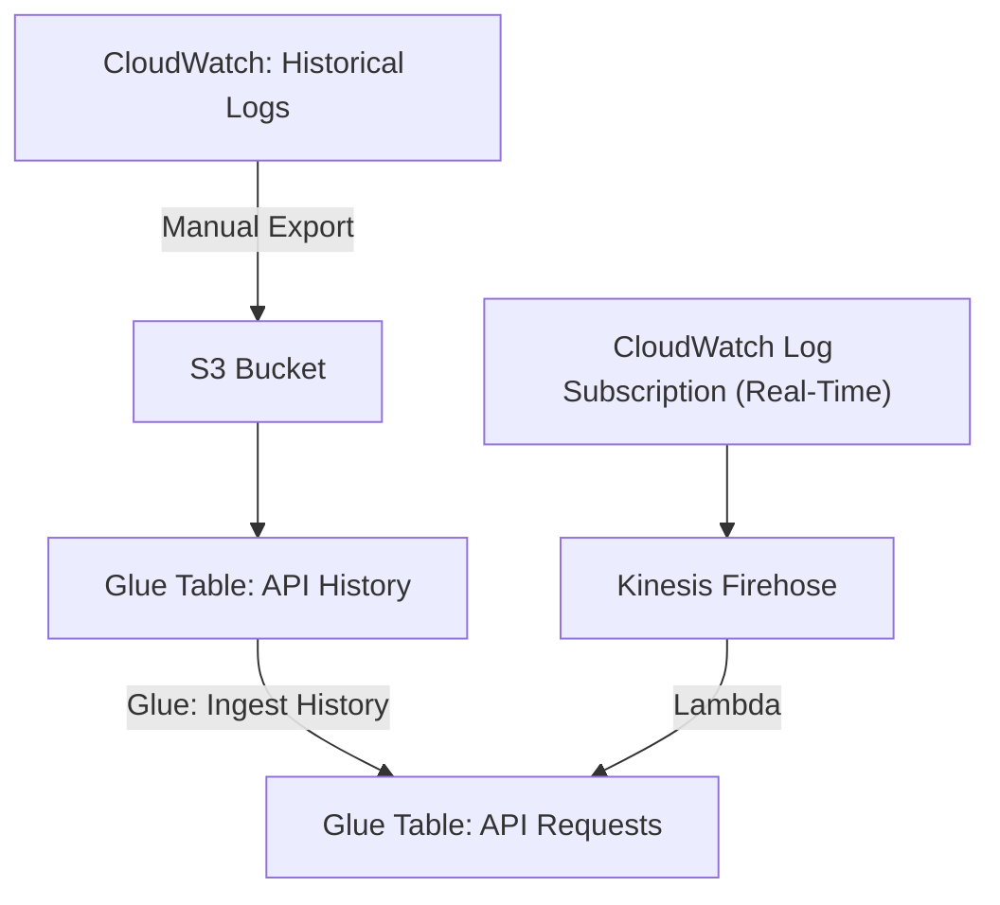
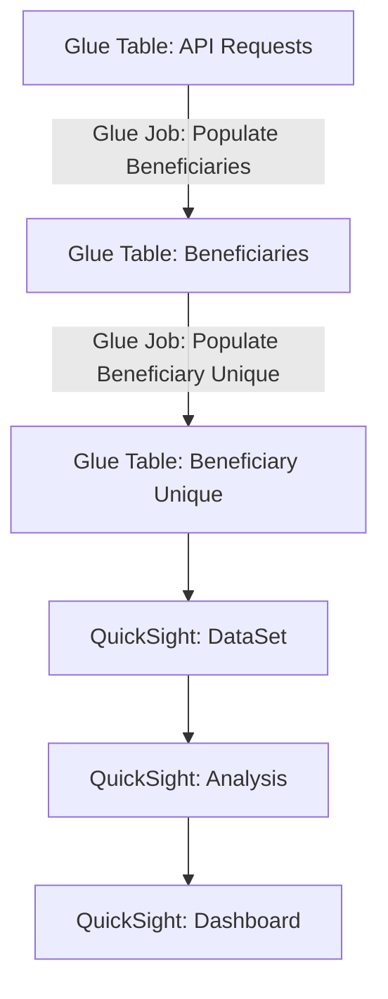

# BFD Insights: BFD Dashboards

BFD Insights captures data in near-real-time from the EC2 instances and provides the data for
analysis in QuickSight.

## API-Requests

API-Requests is the portion of the project that ingests the logs and stores them in Glue tables.
Normally, this happens in real time through AWS Kinesis Firehose, but it can also be done manually
by exporting logs from CloudWatch and running a Glue Job to ingest them into the API-Requests
table. Most other parts of this project will depend upon API-Requests.

## Naming Conventions

### AWS Resources

Somewhere in the BFD documentation (which I cannot presently find; please update if found), there
was a convention to name AWS resources to clearly identify that the resource belongs to BFD
Insights and to which project (BFD, BB2, AB2D, etc.), plus an identifier for the environment (prod,
prod-sbx, test). The convention is: `bfd-insights-<project>-<environment>-<identifier>` in kebab
case (lower-case words separated by hyphens). The exception is for AWS Glue / Athena table names,
which must be in snake case (lower-case separated by underscores), because the hyphen is not a
valid character in Athena table names. For example, we have
`bfd-insights-bfd-prod-sbx-firehose-ingester` and `bfd-insights-bfd-test-api-requests-crawler`.
However, for Glue Tables, we have `bfd_insights_bfd_prod_sbx_api_requests`.

### Terraform Resources

The terraform resource names do not need to be labeled with the
`bfd-insights-<project>-<environment>-` prefix, because it should be clear from context what project
they belong in, and environment is derived from the workspace. However, we have decided on a naming
convention like `<function>-<identifier>` in kebab case (lower-case words separated by hyphens), so
that even the modules, which do not clearly indicate the type of AWS resource they represent, will
be clear. For example, we have `module.glue-table-api-requests` and
`aws_glue_crawler.glue-crawler-api-requests`.

### Structure

### Manual Ingestion of Log Files

Note: Replace `<environment>` and `<account-number>` with the name of your environment, such as
`prod` or `prod-sbx`, and the AWS account number, respectively. Replace any `-` with `_` in
`<underscore_environment>` (Athena doesn't like hyphens in table names).

1. CloudWatch > Log Groups > `/bfd/<environment>/bfd-server/access.json`
    - Actions > Export Data to Amazon S3
        - Choose time period
        - Select Account: *This Account*
        - S3 Bucket Name: `bfd-insights-bfd-app-logs`
        - S3 Bucket Prefix: `history/temp-<environment>`.
    - Export. This took about 80 minutes for 3 weeks of prod-sbx logs.

2. S3
    - Select bucket `bfd-insights-bfd-app-logs`
    - Go to path `history/temp-<environment>`
    - Select all objects *except* `aws-logs-write-test`
    - Actions > Move
        - Bucket
        - Destination: `bfd-insights-bfd-<account-number>/databases/bfd-insights-bfd-<environment>/bfd_insights_bfd_<underscore_environment>_api_history/`
        - Move

3. AWS Glue > Workflows > `bfd-insights-bfd-<environment>-history-workflow`
    - Actions > Run. The entire workflow may take a bit to run through, but you can track progress
    in the graph: History > (choose the top item) > Run Details.

## Beneficiaries

Beneficiaries is the portion that selects the beneficiary and timestamp from the API-Requests
table. Beneficiaries-Unique (which is included within this portion of BFD Insights) includes the
calculations of when each beneficiary was first queried.

### Structure

## Manual Creation of QuickSight Dashboards

Note: Replace `<environment>` with the name of your environment, such as `prod` or `prod-sbx`.
Replace any `-` with `_` in `<underscore_environment>` (Athena doesn't like hyphens in table
names).

1. Go to [QuickSight](https://us-east-1.quicksight.aws.amazon.com/).
2. Create the Unique Beneficiaries dashboard.
    - Create the dataset.
        - Datasets. New Dataset.
        - Athena.
            - Name your data source. Example: `bfd-<environment>-unique-beneficiaries`
            - Athena Workgroup: `bfd`
            - Create Data Source.
        - Choose Your Table.
            - Catalog: `AwsDataCatalog`
            - Database: `bfd-<environment>`
            - Table: Choose the one you want to query. Ex:
            `bfd_<underscore_environment>_beneficiaries`
            - Use Custom SQL.
        - Enter custom SQL query
            - At the top, where is says "New custom SQL", replace that with the title of the data
            source, such as `bfd-<environment>-beneficiaries`.
            - Enter this:
            `SELECT bene_id, MIN(timestamp) AS first_seen FROM bfd-insights-bfd-<environment>"."bfd_insights_bfd_<underscore_environment>_api_requests_beneficiaries" GROUP BY "bene_id"`
            - Confirm query.
        - Finish dataset creation.
            - Directly query your data.
            - Visualize.
    - Create the analysis.
        - Add a Key Performance Indicator (KPI).
            - Under Visual Types (on the left), select "KPI" (it's second in the list and looks
            like two arrows over a line)
            - Expand "Field Wells" at the top if it isn't already expanded.
            - Drag `bene_id` from the left to the "Value" field well at the top.
            - Click the pencil in the upper right of the sheet to edit.
                - Expand "Title".
                - Edit title. Make it "Count of unique beneficiaries queried".
                - Edit subtitle. Make this one "If a beneficiary is queried five times, it counts
                here only once."
            - Right-click on the down-arrow next to "Sheet 1" and Rename the sheet to "Unique
            Beneficiaries".
        - Add a Vertical Bar Chart sheet.
            - Click the + next to the first sheet to add a new sheet.
            - Under Visual Types (on the left), select "Vertical Bar Chart".
            - Expand "Field Wells" at the top if it isn't already expanded.
            - Drag `bene_id` from the left to "Value" field well at the top.
            - Drag `first_seen` to the "X Axis" field well at the top.
            - Right-click on the down-arrow next to "Sheet 2" and Rename the sheet to "First
            Queried".
    - Create the dashboard.
        - While still on the analysis screen, in the upper-right, click Share > Publish Dashboard.
        Choose a name. Example: `<environment> Unique Beneficiaries`.
        - The default options should otherwise be fine, so click Publish Dashboard.
    - Make the dashboard public.
        - While still on the dashboard screen, in the upper right, click Share > Share dashboard.
        - On the left, there is a toggle under "Enable access for" labeled "Everyone in this
        account". Turn it on.
2. Create the Beneficiaries dashboard.
    - Create the dataset.
        - Datasets. New Dataset.
        - Athena.
            - Name your data source. Example: `bfd-<environment>-beneficiaries`
            - Athena Workgroup: `bfd`
            - Create Data Source.
        - Choose Your Table.
            - Catalog: `AwsDataCatalog`
            - Database: `bfd-<environment>`
            - Table: Choose the one you want to query. Ex:
            `bfd_<underscore_environment>_beneficiaries`
            - Select.
        - Finish dataset creation.
            - Directly query your data.
            - Visualize.
        - Finish dataset creation.
            - Directly query your data.
            - Visualize.
    - Create the analysis.
        - Add a Key Performance Indicator (KPI).
            - Under Visual Types (on the left), select "KPI" (it's second in the list and looks
            like two arrows over a line)
            - Expand "Field Wells" at the top if it isn't already expanded.
            - Drag `bene_id` from the left to the "Value" field well at the top.
            - Click the pencil in the upper right of the sheet to edit.
                - Expand "Title".
                - Edit title. Make it "Count of beneficiaries queried".
                - Edit subtitle. Make this one "Not unique. If a beneficiary is queried five times,
                it counts here all five times."
            - Right-click on the down-arrow next to "Sheet 1" and Rename the sheet to "Beneficiary
            Queries".
        - Add a Vertical Bar Chart sheet.
            - Click the + next to the first sheet to add a new sheet.
            - Under Visual Types (on the left), select "Vertical Bar Chart".
            - Expand "Field Wells" at the top if it isn't already expanded.
            - Drag `bene_id` from the left to "Value" field well at the top.
            - Drag `timestamp` to the "X Axis" field well at the top.
            - Right-click on the down-arrow next to "Sheet 2" and Rename the sheet to "Daily
            Queries".
    - Create the dashboard.
        - While still on the analysis screen, in the upper-right, click Share > Publish Dashboard.
        Choose a name. Example: `<environment> Beneficiaries`.
        - The default options should otherwise be fine, so click Publish Dashboard.
    - Make the dashboard public.
        - While still on the dashboard screen, in the upper right, click Share > Share dashboard.
        - On the left, there is a toggle under "Enable access for" labeled "Everyone in this
        account". Turn it on.

### Important Performance Note

Performance of AWS QuickSight *should* roughly track performance of Athena, but there have been
concerns about being able to query a large data set in the above way. As the size of the
`api_requests_beneficiaries` table gets larger, QuickSight may run into performance problems and
possibly even timeout when you try to view the dashboard. To get around this, it might be
possible to enable SPICE (a pre-caching of the queried data; but look into pricing!) or to
re-create the `beneficiaries_unique` Glue table, which was originally used to calculate and store
`bene_id` along with `first_seen` in a separate Glue table for faster queries.
